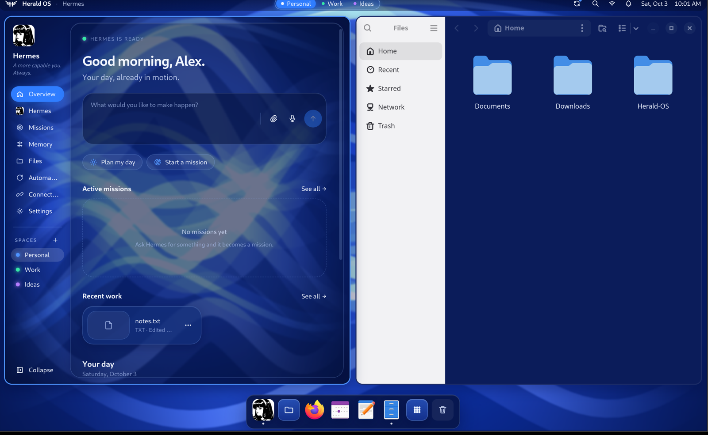
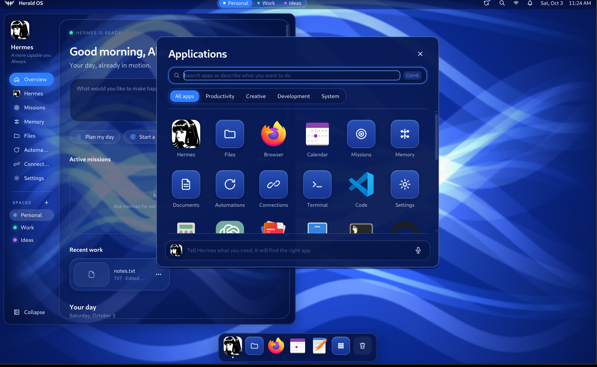
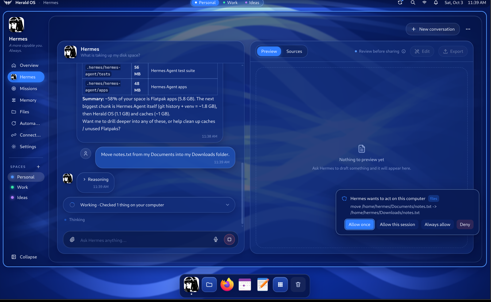

<p align="center">
  
</p>

<h1 align="center">Herald OS</h1>

<p align="center">
  An agent-native operating system, with <a href="https://github.com/NousResearch/hermes-agent">Hermes Agent</a> as the interface.
</p>

<p align="center">
  <a href="https://github.com/iamlukethedev/Herald-OS/actions/workflows/ci.yml"></a>
  <a href="LICENSE"></a>
</p>



Herald OS is an operating system built around an AI agent. Instead of working through menus and
folders yourself, you talk or type to Hermes, and it works across the whole machine: it opens apps,
finds and organises files, watches what is running, remembers what matters to you, runs routines on
a schedule, and builds software while you watch. Every action that changes something goes through a
permission system you control.

> [!NOTE]
> **Herald OS is an independent project by [Luke The Dev](https://github.com/iamlukethedev).** It is
> not an official Hermes or Nous Research product, and it is not affiliated with, sponsored by or
> endorsed by Nous Research. Herald OS runs on [Hermes Agent](https://github.com/NousResearch/hermes-agent),
> the open-source agent Nous Research publishes, which is installed alongside it.

> **Status: alpha (0.1).** Expect rough edges, and keep backups of anything you let an agent
> touch.

## How Herald OS fits together

**Herald OS Linux is the operating system.** Fedora supplies the kernel, drivers and packages, and
everything you see is Herald. The machine boots to the Herald splash screen and signs you straight
in. The niri compositor arranges the windows, Herald draws the menu bar, dock, notifications, app
launcher and system menus, and its theme styles the lock screen. Hermes starts with the session,
with tools to see and operate the machine. Linux apps such as Firefox, LibreOffice and VS Code run
as windows inside it, and a curated set comes preinstalled. Herald OS Linux is in development and
runs in a virtual machine on Apple Silicon Macs; an installable image for PCs is planned.

**Herald OS also runs on a Mac,** fullscreen over macOS: the same interface, agent and tools, with
macOS underneath handling the hardware and your Mac apps. It is the quickest way to try Herald OS,
and where most of it is built.

Herald OS does not fork Hermes. It runs a standard Hermes Agent install and adds its system
abilities as a regular Hermes plugin, `herald-os-bridge`.

## A look around

<table>
  <tr>
    <td width="50%"></td>
    <td width="50%"></td>
  </tr>
  <tr>
    <td>Herald OS Linux boots to its own splash screen and signs you straight in.</td>
    <td>The launcher holds Herald's own apps and every installed Linux app.</td>
  </tr>
  <tr>
    <td width="50%"></td>
    <td width="50%"></td>
  </tr>
  <tr>
    <td>One menu installs apps, changes the theme and updates the system. Hermes can do the same.</td>
    <td>Hermes answers with its system tools and asks before it changes anything.</td>
  </tr>
</table>

## What you get

- **Hermes at the centre.** Overview, Hermes, Missions, Memory, Files, Automations, Connections and
  Settings, plus a Terminal, a System monitor, and floating chat windows.
- **A command bar** for every action in the OS: open pages and apps, add memories, run automations,
  start missions.
- **System tools for Hermes**: system info, processes, disk usage, file search, opening apps,
  moving and trashing files, and more, each with a permission tier, protected paths, an audit log
  and the standard Hermes approval card. See [docs/SYSTEM-BRIDGE.md](docs/SYSTEM-BRIDGE.md).
- **Voice**: press the voice key or say "hey Hermes" and talk. Hermes answers out loud and can
  operate the interface ("open missions", "remember that my sister's birthday is in May"). A free
  engine works with any speech provider; an opt-in realtime engine is available. See
  [docs/VOICE.md](docs/VOICE.md).
- **Studio**: say "build a website for a hair salon" and watch it happen in one window: the
  project's files, the code as it is written, the commands it runs, and a live preview.
- **On Herald OS Linux, the rest of an OS**: a control menu to install and remove apps, change the
  theme and update the system; four themes that recolour everything from the menu bar to the
  terminal; a curated app set; web apps in their own windows; clipboard history, a lock screen and a
  power menu; and one command, `herald-os update`, that updates Herald OS, Hermes and Fedora.

## Getting started

There are two ways to run Herald OS:

- **Herald OS Linux in a virtual machine** gives you the whole operating system. The first setup
  takes about half an hour, most of it downloads.
- **Herald OS on macOS** is ready in a few minutes if you already have Node.js.

Either way, Hermes needs a model provider: a [Nous Portal](https://portal.nousresearch.com) account,
or an API key for a provider Hermes supports (OpenRouter, OpenAI, Anthropic, a local model, and
others).

### Herald OS Linux (virtual machine)

You need an Apple Silicon Mac with [Homebrew](https://brew.sh) and about 20 GB of free disk space.
The virtual machine gets 4 cores and 8 GB of memory; on a Mac with 8 GB in total, start it with
`MEM=4096` in front of the command. Nothing on the Mac itself changes: the VM is a disk image in
`linux/vm/build/`.

**1. Install QEMU and get the code.**

```bash
brew install qemu
git clone https://github.com/iamlukethedev/Herald-OS.git
cd Herald-OS
```

**2. Download Fedora and prepare the first boot.**

```bash
bash linux/vm/download-image.sh   # Fedora Cloud for ARM, about 500 MB
bash linux/vm/make-seed.sh        # first-boot setup and an SSH key, in linux/vm/build/
```

**3. Boot the virtual machine.** A window opens on your Mac. The first boot installs Herald OS:
the system packages, Hermes Agent and the default apps.

```bash
bash linux/vm/run-qemu.sh
bash linux/vm/run-qemu.sh console   # follow the install; Ctrl+C stops watching
```

Wait until the console prints `==> Provisioning complete`. That takes 30 to 45 minutes, mostly
downloads. If it prints `==> Provisioning FAILED` instead, see [Troubleshooting](#troubleshooting).

**4. Install the Herald shell.** This copies your checkout into the VM, builds it there and starts
Herald OS:

```bash
bash linux/dev/push.sh
```

**5. Sign Hermes in.** The first time Hermes needs a model, Herald OS shows a sign-in card with a
short code: open the link on any device and enter the code. To use an API key or another provider
instead, open a shell in the VM with `bash linux/dev/push.sh ssh` and run `hermes setup`.

From then on, `bash linux/vm/run-qemu.sh stop` shuts the VM down and `bash linux/vm/run-qemu.sh`
starts it again, straight into Herald OS. After you change the code on your Mac,
`bash linux/dev/push.sh` installs it. [docs/LINUX.md](docs/LINUX.md) covers UTM, display scaling on
Retina screens, the session model and the dev loop.

### Herald OS on macOS

You need:

- **macOS 13 (Ventura) or later on Apple Silicon.** Intel Macs are untested. Herald OS is
  developed on macOS 26.
- **Node.js 22.12 or later** ([nodejs.org](https://nodejs.org), or `brew install node`).
- **Git**, and the Xcode Command Line Tools (`xcode-select --install`) for native modules.
- **Hermes Agent 0.21.3 or later**, with a model provider set up (step 1 below).

**1. Install Hermes Agent and choose a model.** Herald OS on macOS uses your own Hermes install.
If you don't have it yet:

```bash
curl -fsSL https://hermes-agent.nousresearch.com/install.sh | bash
source ~/.zshrc
hermes setup
```

`hermes setup` walks you through choosing a model provider and signing in. You can change it later
with `hermes model`, or from Herald OS under Settings. Check that Hermes works on its own before
going further:

```bash
hermes doctor
hermes        # say hello, then exit with Ctrl+D
```

**2. Get the code.**

```bash
git clone https://github.com/iamlukethedev/Herald-OS.git
cd Herald-OS
```

**3. Bootstrap.**

```bash
npm run bootstrap
```

This is safe to re-run, and you should re-run it after every `git pull`. It:

1. downloads the pinned Hermes gateway client the shell is compiled against (`upstream/`);
2. installs the Node packages and downloads Electron;
3. links the `herald-os-bridge` plugin into `~/.hermes/plugins` and enables it and its tools;
4. migrates settings from the project's earlier name (Hermes OS), if you had it installed;
5. reports which optional voice packages your Hermes install has.

**4. Start Herald OS.**

```bash
npm run dev
```

Herald OS starts your Hermes runtime in the background (`hermes serve`, on 127.0.0.1 only), shows
the boot screen, and takes over the screen. `Cmd+Ctrl+F` leaves or re-enters fullscreen; `Cmd+Q`
quits and stops the backend it started.

Edits to the interface (`apps/desktop/src`) reload live. Changes to the Electron main process need
a restart (`Ctrl+C`, then `npm run dev` again).

**5. Check that everything works.**

- **Hermes answers.** Open the Hermes page (`Cmd+2`) and ask something. If it asks you to sign in,
  use the card it shows, or run `hermes setup` again.
- **System tools work.** Ask "what is using the most memory right now?". Hermes should answer with
  the `system_processes` tool rather than a shell command. Ask it to move a file and you should get
  an approval card first.
- **Voice works (optional).** Press `Alt+Space` and allow microphone access when macOS asks.
  Settings > Voice has "Say hello" and "Start talking" buttons to test it.

## Using Herald OS

### Keyboard shortcuts

On Herald OS Linux the system key is `Super` (the Windows or Command key), and `Super+K` lists every
shortcut. In the virtual machine the system key is `Alt` (`Option` on a Mac keyboard) instead, so
`Super+A` becomes `Alt+A`: the Mac keeps `Command` for itself. Herald's own pages also answer to
`Ctrl` on Linux, so `Ctrl+K` and `Ctrl+1` work everywhere.

| Action | Herald OS Linux | macOS |
| --- | --- | --- |
| Command bar | `Super+Shift+Space` or `Ctrl+K` | `Cmd+K` |
| All applications | `Super+A` | `Cmd+Shift+A` |
| Talk to Hermes | `Super+V` | `Alt+Space` |
| Ask Hermes about the focused window | `Super+Space` | |
| Herald OS menu: apps, themes, updates | `Super+M` or `Super+Alt+Space` | |
| Overview, Hermes, Missions, Memory, Files, Automations, Connections | `Ctrl+1` ... `Ctrl+7` | `Cmd+1` ... `Cmd+7` |
| Settings | `Super+,` | `Cmd+,` |
| Terminal | `Super+Return` | `Cmd+8` |
| Close window | `Super+Q` | `Cmd+W` |
| Clipboard history | `Super+Ctrl+V` | |
| Lock, power menu | `Super+Ctrl+L`, `Super+Escape` | |
| Toggle fullscreen, quit | | `Cmd+Ctrl+F`, `Cmd+Q` |

On Linux, every hotkey and menu item is a `herald-os` command, so Hermes and your scripts can do
the same things: `herald-os install app obsidian`, `herald-os theme set ice`, `herald-os update`.
`herald-os commands` lists them all.

### Permissions

Hermes's system tools have four tiers. `read` tools (system info, file search) and `act` tools
(opening an app) run straight away and are logged. `mutate` tools (create, move, rename) ask first,
and you can allow them for the session or always. `destructive` tools (stopping a process, moving
files to the Trash) ask every time. Some locations, such as `~/.ssh`, your keychains and Hermes's
own credentials, are always refused.

Settings > Privacy shows the policy and the audit log (`~/.hermes/herald-os/audit.jsonl`). Hermes's
own terminal tool keeps following Hermes's approval settings.

### Settings and data

| What | Where |
| --- | --- |
| Herald OS preferences | `~/.hermes/herald-os/prefs.json` (edit them in Settings) |
| Audit log, control socket | `~/.hermes/herald-os/` |
| Log file | `~/.hermes/logs/herald-os.log` |
| Hermes config, memories, sessions, credentials | `~/.hermes/`, managed by Hermes |

A few options come from environment variables, mostly for development: starting windowed on macOS
(`HERALD_OS_WINDOWED=1`), using a different Hermes checkout (`HERALD_OS_HERMES_ROOT`), or a
throwaway Hermes home (`HERMES_HOME=/tmp/herald-test`). [.env.example](.env.example) lists them
all.

## Building a macOS release

```bash
npm run dist:mac
```

This writes an Apple Silicon DMG and zip to `apps/desktop/release/`. Before installing, know that:

- **The build is not notarized.** electron-builder signs it with a code-signing identity from your
  keychain if it finds one, and leaves it unsigned otherwise. A copy that was downloaded or sent to
  you will not open the first time: choose Open Anyway in System Settings → Privacy & Security, or
  run `xattr -dr com.apple.quarantine "/Applications/Herald OS.app"`.
- **macOS notifications need a signed build.** Notifications still appear inside Herald OS, but the
  macOS ones it sends while you are in another app only work when the build is code-signed.
- **The system tools plugin is not bundled.** Run `npm run bootstrap` from a checkout once so
  Hermes loads `herald-os-bridge`.
- **Hermes Agent is not bundled either.** The build finds it as in development:
  `HERALD_OS_HERMES_ROOT`, then `~/.hermes/hermes-agent`, then `hermes` on your PATH.

## Project layout

```
apps/desktop/               The Herald shell: Electron main (electron/), preload/, React interface (src/)
packages/hermes-client/     Typed client for the Hermes gateway (JSON-RPC over WebSocket, REST)
plugins/herald-os-bridge/   Hermes plugin: system tools, permission tiers, audit log, UI control
linux/                      Herald OS Linux: provisioning, session, niri config, themes, apps, VM tooling
scripts/                    bootstrap, upstream sync, bridge tests, secret scan
upstream/                   UPSTREAM.lock, the pinned Hermes version the shell builds against
docs/                       architecture, decisions, system bridge, voice, Linux
```

New here? Read [docs/ARCHITECTURE.md](docs/ARCHITECTURE.md), then
[apps/desktop/README.md](apps/desktop/README.md) for where things go in the shell.

## Development

```bash
npm run typecheck     # TypeScript: interface, Electron main and preload, client package
npm test              # Vitest
npm run test:bridge   # pytest for the bridge plugin
npm run build         # production build into apps/desktop/dist
bash scripts/check-secrets.sh   # gitleaks over the history and your changes
```

CI runs all of these on Ubuntu and macOS. [CONTRIBUTING.md](CONTRIBUTING.md) has the conventions.

## Updating

On macOS:

```bash
git pull
npm run bootstrap
hermes update         # Hermes itself, whenever you like
```

For the Linux VM, run `git pull` on the Mac and then `bash linux/dev/push.sh`. Inside Herald OS
Linux, `herald-os update` upgrades Hermes Agent, the Fedora packages and the Flatpak apps.

The shell compiles against a pinned Hermes version (`upstream/UPSTREAM.lock`), so updating Hermes
does not change the shell's code. Moving the pin is described in [upstream/README.md](upstream/README.md).

## Troubleshooting

- **"No Hermes runtime found", or the boot screen never finishes.** Run `hermes doctor`. If Hermes
  lives somewhere other than `~/.hermes/hermes-agent` and is not on your PATH, start with
  `HERALD_OS_HERMES_ROOT=/path/to/hermes-agent npm run dev`. The cause is usually in
  `~/.hermes/logs/herald-os.log`.
- **Hermes uses shell commands instead of its system tools.** Re-run `npm run bootstrap`, then
  restart Herald OS. `hermes plugins list` should show `herald-os-bridge` as enabled.
- **The VM's first boot fails or never finishes.** A failed step prints
  `==> Provisioning FAILED at line N`, and `bash linux/vm/run-qemu.sh console` shows where it
  stopped. `/var/log/herald-os-provision.log` in the VM has the whole run (`bash linux/dev/push.sh ssh`
  opens a shell there). `bash linux/vm/run-qemu.sh reset` deletes the VM's disk so the next start
  begins again.
- **Herald OS Linux shows a black screen after `push.sh`.** Open a shell with
  `bash linux/dev/push.sh ssh` and read `~/.local/state/herald-os/shell.log` and
  `journalctl -u greetd`.
- **`npm run dev` waits on a download.** Electron downloads itself on first use. Bootstrap does this
  up front; behind a proxy, see [Electron's installation docs](https://www.electronjs.org/docs/latest/tutorial/installation).
- **Native module errors after changing Node versions.** Delete `node_modules` and run
  `npm run bootstrap` again.
- **The microphone does nothing on macOS.** Check System Settings > Privacy & Security >
  Microphone. In development the permission belongs to Electron (or your terminal); in a built
  release, to Herald OS.
- **Stuck fullscreen on macOS.** `Cmd+Ctrl+F`, or start with `HERALD_OS_WINDOWED=1 npm run dev`.

## Contributing and security

Contributions are welcome: see [CONTRIBUTING.md](CONTRIBUTING.md). Please report vulnerabilities
privately, as described in [SECURITY.md](SECURITY.md).

## License

[MIT](LICENSE). Herald OS builds on [Hermes Agent](https://github.com/NousResearch/hermes-agent) by
Nous Research, also MIT; see [NOTICE](NOTICE). Herald OS is an independent project and is not
affiliated with Nous Research; the Hermes names refer to Nous Research's project and are used only
to say what Herald OS runs on.
