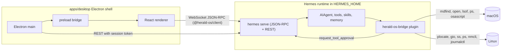

# Herald OS Architecture

Herald OS is an agent-native desktop environment. It runs on top of macOS (Apple Silicon first)
and makes Hermes Agent the primary interface between the user and the computer. It is a separate
product from Hermes Desktop: it consumes the upstream Hermes runtime unchanged and grows its own
shell on top.

## Three authorities

The same seam rules upstream Hermes Desktop uses apply here:

| Party | Owns | Lives in |
| --- | --- | --- |
| Electron main | The machine: window/fullscreen lifecycle, backend process, PTYs, filesystem, app discovery, system stats, notifications, typed IPC | `apps/desktop/electron` |
| Renderer (React) | The experience: surfaces, navigation, presentation, ephemeral interaction state | `apps/desktop/src` |
| Hermes runtime | The work: sessions, model calls, tools, skills, memory, cron, approvals | the user's Hermes install (`$HERMES_HOME/hermes-agent`) |

The renderer never touches Node or Electron directly; native power arrives through a narrow,
typed preload bridge (`window.heraldOS`). Agent behaviour is never re-implemented in React.

## Host platforms

Both seams (`HostPlatform` in Electron main, `HostAdapter` in the bridge plugin) are implemented per
host. The renderer and the agent see identical tool names and return shapes on every platform.

| | macOS | Linux (Herald OS Linux) | Windows |
| --- | --- | --- | --- |
| Shell runs as | fullscreen app over the macOS desktop | the whole session: `greetd` -> `cage` -> shell (`HERALD_OS_KIOSK=1`) | stub |
| `HostPlatform` | `platform/darwin.ts` (`plutil`, `sips`, `qlmanage`, `mdfind`, EventKit JXA) | `platform/linux.ts` (`/proc`, `.desktop` entries, icon themes, `nmcli`, `recently-used.xbel`, GNOME thumbnail cache) | `platform/generic.ts` |
| `HostAdapter` | `host/darwin.py` (`osascript`, `lsof`, `mdfind`, `system_profiler`, `pmset`) | `host/linux.py` (`ps`, `ss`, `plocate`/`fd`, `gio`, `xdg-open`, `nmcli`, `bluetoothctl`, `wpctl`, `gsettings`, `journalctl`, `loginctl`) | `host/windows.py` stub |
| App launch / reveal | `shell.openPath` / `showItemInFolder` | `gio launch <.desktop>` / `org.freedesktop.FileManager1` | |
| Calendar | EventKit with permission state | unavailable (EDS later) | |

Setup, session model and dev loop for Linux: `docs/LINUX.md`.

## Backend lifecycle

1. Resolve a runtime through an ordered ladder (`apps/desktop/electron/backend/resolve.ts`):
   `HERALD_OS_HERMES_ROOT` -> `$HERMES_HOME/hermes-agent` managed install (its `venv/bin/python`)
   -> `hermes` on `PATH`. Each candidate is probed before use.
2. Spawn `hermes serve --host 127.0.0.1 --port 0` with `HERMES_DASHBOARD_SESSION_TOKEN` (random per
   launch), `HERALD_OS=1`, and `HERMES_HOME`.
3. Read `HERMES_BACKEND_READY port=N` from stdout, then poll `GET /api/status` with
   `X-Hermes-Session-Token` until it answers.
4. Hand `{ wsUrl, baseUrl }` to the renderer. The renderer dials `ws://127.0.0.1:N/api/ws?token=...`
   with the upstream `JsonRpcGatewayClient`; REST calls go through main so the renderer only ever
   sees a capability, not a credential.
5. On exit the child is restarted with bounded backoff; after the budget is exhausted the shell
   shows a recoverable failure screen instead of spinning.

## Wire contract

The wire is declared in Python (`tui_gateway/contracts`) and generated into
`apps/shared/src/gateway-contract.generated.ts` upstream. Herald OS re-exports that file through
`packages/hermes-client`, so a field the backend stops sending fails `tsc` here instead of drifting.

Sessions are created with `source: "herald_os"`. Upstream only folds Desktop-only GUI tools into
sessions whose source is `desktop`, so a Herald OS session never receives tools whose client half
lives in Hermes Desktop.

Server-to-client requests the shell answers: `approval`, `clarify`, `sudo`, `secret`. Anything else
is declined with `-32601` so the backend treats it as unanswered rather than hanging.

## Renderer

Paths in this section and the next are relative to `apps/desktop`.

The renderer draws a whole desktop: wallpaper, menu bar, dock, command bar (`Cmd+K`), notifications
and a small window manager. Its apps are registered in `src/shell/apps.ts`:

- **Pages** of the main Hermes window, picked from its sidebar: Overview, Hermes (chat), Missions,
  Memory, Files, Automations, Connections, Settings.
- **Floating apps** with their own window: Terminal, System, Web, Studio, and a chat pop-out.

It runs in one of two modes, chosen by Electron main (`electron/shell/mode.ts`):

| Mode | Used by | Windows |
| --- | --- | --- |
| `desktop` | macOS, Linux under `cage` | One fullscreen Electron window; the renderer's own window manager (`src/store/windows.ts`, `src/shell/wm/`) lays out every app inside it. |
| `panels` | Linux under `niri` (`HERALD_OS_SHELL_MODE=panels`) | One Electron window per surface (menu bar, dock, main window, command bar, wallpaper, each floating app), tiled by the compositor. `src/shell/ShellRoot.tsx` picks what each window shows. |

Code layout (details in [`apps/desktop/README.md`](../apps/desktop/README.md), conventions in
[`apps/desktop/DESIGN.md`](../apps/desktop/DESIGN.md)): `src/shell` is the desktop chrome,
`src/features/<app>` holds one folder per app, `src/store` the nanostores state and actions,
`src/lib` pure helpers with their tests, `src/commands` the OS command catalogue.

## OS control

Everything a user can do in the shell is also a registered command (`src/store/os-commands.ts`,
catalogue in `src/commands/`), so three callers drive the UI the same way:

1. The command bar.
2. The voice fast path (`src/lib/voice/intents.ts`), which runs simple requests such as "open
   missions" or "hide the sidebar" locally, without a model round-trip.
3. Hermes itself, through the bridge's `os_ui` tool. Electron main serves a JSON-lines Unix socket
   (`~/.hermes/herald-os/control.sock` in desktop mode, `$XDG_RUNTIME_DIR/herald-os/control.sock`
   in panels mode) and hands the backend its path and a per-launch token
   (`HERALD_OS_CONTROL_SOCKET`, `HERALD_OS_CONTROL_TOKEN`). The socket is readable only by the
   user (mode 0600) and refuses requests without the token. In panels mode it also serves the
   `herald-os` CLI that the compositor's hotkeys call; those commands need no token.

Voice (engines, wake word, barge-in) is described in [`VOICE.md`](VOICE.md).

## System bridge

`plugins/herald-os-bridge` is a regular out-of-tree Hermes plugin. It registers a narrow toolset
(`herald_os`) that exposes the host machine through explicit, permission-tiered tools. Execution
happens on the backend host behind a `HostAdapter` abstraction (`darwin` and `linux` implemented;
`windows` is a stub). Sensitive operations route through upstream's own approval gate
(`tools.approval.request_tool_approval`) so the shell renders one approval card for everything.
See [`SYSTEM-BRIDGE.md`](SYSTEM-BRIDGE.md).

## Upstream compatibility

- The Python runtime is never forked: it is whatever `hermes update` installs.
- Only `apps/shared/src` is compiled into Herald OS, from a pinned snapshot
  (`upstream/UPSTREAM.lock`, fetched by `scripts/sync-upstream.sh`).
- The plugin uses only public plugin APIs (`register`, `ctx.register_tool`, `ctx.register_skill`,
  `tools.approval.request_tool_approval`).
- Anything Herald OS needs from core that does not exist yet (for example a generic plugin
  server-request hook for client-side execution) is proposed upstream rather than patched locally.
