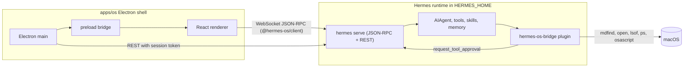

# Hermes OS Architecture

Hermes OS is an agent-native desktop environment. It runs on top of macOS (Apple Silicon first)
and makes Hermes Agent the primary interface between the user and the computer. It is a separate
product from Hermes Desktop: it consumes the upstream Hermes runtime unchanged and grows its own
shell on top.

## Three authorities

The same seam rules upstream Hermes Desktop uses apply here:

| Party | Owns | Lives in |
| --- | --- | --- |
| Electron main | The machine: window/fullscreen lifecycle, backend process, PTYs, filesystem, app discovery, system stats, notifications, typed IPC | `apps/os/electron` |
| Renderer (React) | The experience: surfaces, navigation, presentation, ephemeral interaction state | `apps/os/src` |
| Hermes runtime | The work: sessions, model calls, tools, skills, memory, cron, approvals | the user's Hermes install (`$HERMES_HOME/hermes-agent`) |

The renderer never touches Node or Electron directly; native power arrives through a narrow,
typed preload bridge (`window.hermesOS`). Agent behaviour is never re-implemented in React.

## Backend lifecycle

1. Resolve a runtime through an ordered ladder (`apps/os/electron/backend/resolve.ts`):
   `HERMES_OS_HERMES_ROOT` -> `$HERMES_HOME/hermes-agent` managed install (its `venv/bin/python`)
   -> `hermes` on `PATH`. Each candidate is probed before use.
2. Spawn `hermes serve --host 127.0.0.1 --port 0` with `HERMES_DASHBOARD_SESSION_TOKEN` (random per
   launch), `HERMES_OS=1`, and `HERMES_HOME`.
3. Read `HERMES_BACKEND_READY port=N` from stdout, then poll `GET /api/status` with
   `X-Hermes-Session-Token` until it answers.
4. Hand `{ wsUrl, baseUrl }` to the renderer. The renderer dials `ws://127.0.0.1:N/api/ws?token=...`
   with the upstream `JsonRpcGatewayClient`; REST calls go through main so the renderer only ever
   sees a capability, not a credential.
5. On exit the child is restarted with bounded backoff; after the budget is exhausted the shell
   shows a recoverable failure screen instead of spinning.

## Wire contract

The wire is declared in Python (`tui_gateway/contracts`) and generated into
`apps/shared/src/gateway-contract.generated.ts` upstream. Hermes OS re-exports that file through
`packages/hermes-client`, so a field the backend stops sending fails `tsc` here instead of drifting.

Sessions are created with `source: "hermes_os"`. Upstream only folds Desktop-only GUI tools into
sessions whose source is `desktop`, so a Hermes OS session never receives tools whose client half
lives in Hermes Desktop.

Server-to-client requests the shell answers: `approval`, `clarify`, `sudo`, `secret`. Anything else
is declined with `-32601` so the backend treats it as unanswered rather than hanging.

## Surfaces

The renderer is a table-driven set of surfaces (`apps/os/src/app/surfaces.ts`): Home, Chat,
Agents, Tasks, Skills, Files, Apps, Terminal, System, Settings, plus a Notifications panel and a
global command bar (`Cmd+K`). Surfaces subscribe to small nanostores; shared stores live in
`src/store`, pure helpers in `src/lib`.

## System bridge

`plugins/hermes-os-bridge` is a regular out-of-tree Hermes plugin. It registers a narrow toolset
(`hermes_os`) that exposes the host machine through explicit, permission-tiered tools. Execution
happens on the backend host behind a `HostAdapter` abstraction (`darwin` implemented; `windows`
and `linux` are stubs). Sensitive operations route through upstream's own approval gate
(`tools.approval.request_tool_approval`) so the shell renders one approval card for everything.
See `SYSTEM-BRIDGE.md`.

## Upstream compatibility

- The Python runtime is never forked: it is whatever `hermes update` installs.
- Only `apps/shared/src` is compiled into Hermes OS, from a pinned snapshot
  (`upstream/UPSTREAM.lock`, fetched by `scripts/sync-upstream.sh`).
- The plugin uses only public plugin APIs (`register`, `ctx.register_tool`, `ctx.register_skill`,
  `tools.approval.request_tool_approval`).
- Anything Hermes OS needs from core that does not exist yet (for example a generic plugin
  server-request hook for client-side execution) is proposed upstream rather than patched locally.
